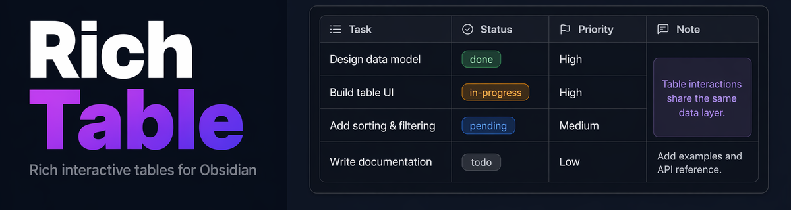

<div align="center">



<p>
  <b>🔀 合并单元格 &nbsp;·&nbsp; 🎨 样式设置 &nbsp;·&nbsp; 🏷️ 类型列 &nbsp;·&nbsp; 🔗 双链补全 &nbsp;·&nbsp; ↕️ 拖拽排序</b>
</p>

<p>
  <a href="https://github.com/SdKay/obsidian-better-table/releases/latest">
    
  </a>
  <a href="https://github.com/SdKay/obsidian-better-table/releases">
    
  </a>
  <a href="LICENSE">
    
  </a>
  <a href="https://obsidian.md">
    
  </a>
</p>

<p>
  <a href="#为什么选择-better-table">为什么？</a> ·
  <a href="#功能演示">演示</a> ·
  <a href="#格式说明">格式</a> ·
  <a href="#功能详解">功能</a> ·
  <a href="#安装">安装</a> ·
  <a href="README.md">English</a>
</p>

<p>
  
  <br/><sub>扫码关注公众号，获取更多 Obsidian 插件与效率工具资讯</sub>
</p>

</div>

> **仅限 Obsidian 使用。** `better-table` 围栏代码块是专为 Obsidian 定制的渲染器，在标准 Markdown 编辑器、GitHub 预览页或任何非 Obsidian 环境中均无法正常显示。

为 Obsidian 打造的富交互表格插件 —— 支持**单元格合并**、内联编辑、双链自动补全、类型列、标题与备注、行列拖拽排序等功能。这些是原生 Obsidian 表格以及大多数社区表格插件无法实现的。

---

## 为什么选择 Better Table？

Obsidian 内置表格本质上是纯 GFM 格式——没有合并单元格、没有列类型、没有可视化编辑。大多数社区插件也绕不开这个限制。Better Table 采用全新思路：通过独立的围栏代码块，在笔记中提供**接近电子表格的体验**。

| 痛点 | 原生表格 | Better Table |
| --- | --- | --- |
| 单元格合并（rowspan / colspan） | ✗ | ✓ |
| 内联点击编辑 | ✗ | ✓ |
| 单元格内 `[[双链]]` 自动补全 | ✗ | ✓ |
| 类型列（状态、优先级…） | ✗ | ✓ |
| 单元格样式（背景色/字体颜色/字号） | ✗ | ✓ |
| 表格标题与底部备注 | ✗ | ✓ |
| 拖拽排序行 / 列 | ✗ | ✓ |
| 插入 / 隐藏 / 删除行列 | ✗ | ✓ |

---

## 功能演示

**1 · 模板快速开始** — 空代码块 → 插入模板 → 单击修改标题

<!-- 录制：打开空 better-table 块，点击"插入模板"，单击标题重命名（约 6 秒） -->


**2 · 合并单元格** — 拖选 → 弹窗点 Merge

<!-- 录制：拖选 3 个格，弹出面板，点击 Merge，看到合并效果（约 6 秒） -->


**3 · 类型列 & 样式设置** — 单击切换值，双击设置背景色和字号

<!-- 录制：单击状态格选 done，双击另一格设背景色+字号后点 Apply（约 7 秒） -->


**4 · 双链自动补全** — 输入 `[[` 触发文件补全，`#` 选标题

<!-- 录制：单击格进入编辑，输入 [[，选择文件，输入 #，选择标题（约 6 秒） -->


**5 · 拖拽排序 & 行列操作** — ⠿ 手柄拖排 + 双击弹出操作菜单

<!-- 录制：拖拽行手柄排序，再双击某格点击"在下方插入行"（约 6 秒） -->


**6 · 标题与底部备注** — 单击内联编辑，Shift+Enter 换行

<!-- 录制：单击标题重命名，单击备注 → Enter 换行 → Shift+Enter 保存（约 6 秒） -->


---

## 格式说明

````markdown
```better-table
---
title: 项目看板
columns:
  - { name: 任务,   width: 200 }
  - { name: 状态,   type: task-status }
  - { name: 负责人 }
  - { name: 优先级, type: priority, align: center }
merges:
  - A3:A4
styles:
  - { target: "1:1", bold: true, bg: "#e8f0fe" }
  - { target: "B*",  bg: "#e6f4ea" }
  - { target: "D2",  size: 14, color: "#c0392b" }
footer: "每周更新 · 点击任意单元格即可编辑"
---
| 任务     | 状态    | 负责人       | 优先级 |
| -------- | ------- | ------------ | ------ |
| 设计架构 | done    | [[Alice]]    | high   |
| 编码实现 | pending | [[teammate]] | medium |
| 测试     | todo    |              | low    |
| 部署上线 | todo    |              | low    |
```
````

### 坐标系

Excel 风格，1-indexed。第 1 行 = 表头行。

| 写法 | 含义 |
| ---- | ---- |
| `A1` | A 列第 1 行（表头） |
| `A1:B3` | 单元格范围 |
| `B*` | B 列整列 |
| `*2` | 第 2 行整行 |
| `1:3` | 行范围 |

---

## 功能详解

### 标题与底部备注
在 YAML 中加入 `title` 和 `footer` 字段，分别在表格上方和下方渲染。支持行内 Markdown（加粗、斜体、双链）。单击即可内联编辑。

```yaml
title: 我的项目看板
footer: "* 数据为估算值 · 最后更新 2025-01"
```

`footer` 支持 YAML 数组实现多行备注，编辑时 Shift+Enter 换行。

### 单元格合并
在 YAML 中声明任意矩形合并区域。交互式编辑时，拖拽选中多个单元格后点击弹窗中的 **Merge** 按钮。如果新合并区域与已有合并部分重叠，插件会自动扩展到最小合法包围盒。

### 内联编辑
**单击**任意单元格进入内联编辑。支持纯文本、双链、加粗/斜体及所有标准行内 Markdown。`Enter` 保存，`Escape` 取消。

### 双链自动补全
在单元格编辑器中输入 `[[` 即触发 Obsidian 原生文件补全：
- `[[filename` — 文件搜索
- `[[filename#heading` — 标题链接
- `[[filename#^blockid` — 内容块引用
- `[[filename|alias` — 链接别名

### 类型列
为列指定类型后，值将渲染为彩色标签徽章。**单击**单元格弹出下拉菜单，直接选择新值，无需手动输入。

**内置类型：**

| 类型 | 可选值 |
| ---- | ------ |
| `task-status` | todo · pending · done · cancel |
| `priority` | high · medium · low |
| `boolean` | yes · no |
| `rating` | ★ 至 ★★★★★ |
| `effort` | XS · S · M · L · XL |
| `approval` | approved · pending · rejected |

自定义类型可在 **设置 → Better Table** 中添加。

### 双击操作面板
双击任意单元格（或右键点击标题格）弹出统一操作面板，包含三个区域：

1. **单元格操作** — 在上/下方插入行、在左/右侧插入列、删除/隐藏行列、取消合并。合并单元格的操作会自动覆盖所占的全部行列范围。
2. **样式设置** — 设置背景色、文字颜色、字体大小，支持实时预览。取消则恢复原样；Apply 持久写回。Clear format 清除该单元格的所有样式。
3. **切换类型** — 仅标题格显示；通过二级菜单切换或清除列类型。

**Ctrl+拖拽**可在不弹出菜单的情况下框选单元格（用于视觉检查范围）。拖拽结束后正常弹出菜单时，第一项为**合并单元格**。

### 样式规则
在 YAML 中对任意目标（单个单元格、范围、整行、整列）设置样式：

```yaml
styles:
  - { target: "1:1",   bold: true, bg: "#f0f4ff" }
  - { target: "B*",    bg: "#e6f4ea" }
  - { target: "A2:A5", color: "#555", size: 13 }
```

支持的属性：`bg`（背景色）、`color`（文字色）、`bold`（加粗）、`italic`（斜体）、`size`（字号 px）。

### 拖拽排序
悬停时显示六点拖拽手柄——列标题顶部用于排序列，数据行左侧用于排序行。被拖动的行/列完全包含的合并区域会随之移动；跨越边界的合并区域保持原位。

### 边缘快速添加
鼠标移到表格底边附近，出现 **+** 条带，点击追加新行；移到右边缘，出现 **+** 条带，点击追加新列。

---

## 安装

1. 打开 **设置 → 第三方插件 → 浏览**。
2. 搜索 **Better Table** 并安装。
3. 启用插件。

手动安装：将 `main.js`、`manifest.json`、`styles.css` 复制到 `<vault>/.obsidian/plugins/better-table/`。

最低 Obsidian 版本：**1.4.10**

---

## 许可证

**非商业用途**免费使用，遵循 [Polyform Noncommercial 1.0.0](https://polyformproject.org/licenses/noncommercial/1.0.0/) 协议。

**商业用途**请联系授权：sdkxyx@gmail.com

## 支持与反馈

问题反馈与功能建议：[GitHub Issues](https://github.com/SdKay/obsidian-better-table/issues)

---

## 已知问题

- **隐藏列指示条宽度**：在部分主题下，`▶N` 指示列会撑满可用空间，原因是主题 CSS 以更高优先级覆盖了 `th` 元素的 `width` 属性。

## 计划中

- **行方向表格**（`direction: row`）：将类型绑定到行而非列。
- **自定义类型可视化 UI**：用图形化界面替换当前的 JSON 文本框。

---

## 开发

```bash
npm install
npm run dev        # 监听模式，修改后自动重建
npm run build      # 生产构建（tsc + 压缩 main.js）
npm run lint       # ESLint（obsidianmd 规则）
```

构建后部署到 vault：

```bash
cp main.js manifest.json styles.css "<vault>/.obsidian/plugins/better-table/"
```

---

## Star 增长趋势

[](https://star-history.com/#SdKay/obsidian-better-table&Date)
