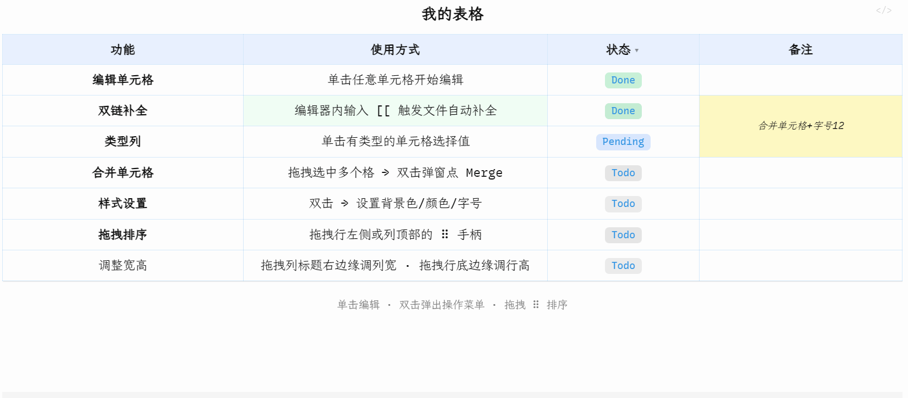
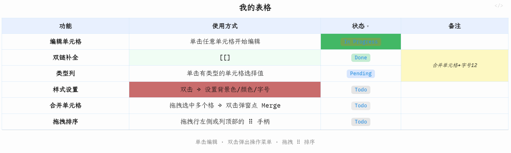

<div align="center">


<p>
  <b>🔀 合并单元格 &nbsp;·&nbsp; 🎨 样式设置 &nbsp;·&nbsp; 🏷️ 类型列 &nbsp;·&nbsp; 🔗 双链补全 &nbsp;·&nbsp; ↕️ 拖拽排序 &nbsp;·&nbsp; ↔️ 调整宽高 &nbsp;·&nbsp; 📐 数学公式 &nbsp;·&nbsp; 📋 列表</b>
</p>

<p>
  <a href="https://github.com/SdKay/obsidian-rich-table/releases/latest">
    
  </a>
  <a href="https://github.com/SdKay/obsidian-rich-table/releases">
    
  </a>
  <a href="LICENSE">
    
  </a>
  <a href="https://obsidian.md/plugins?id=rich-table">
    
  </a>
</p>

<p>
  <a href="#为什么选择-rich-table">为什么？</a> ·
  <a href="#功能演示">演示</a> ·
  <a href="#格式说明">格式</a> ·
  <a href="#功能介绍">功能</a> ·
  <a href="#安装">安装</a> ·
  <a href="README.md">English</a>
</p>

<p>
  
  <br/><sub>扫码关注公众号，获取更多 Obsidian 插件与效率工具资讯</sub>
</p>

</div>

> **仅限 Obsidian 使用。** `rich-table` 围栏代码块由插件渲染，在标准 Markdown 编辑器或 GitHub 预览中无法显示。

为 Obsidian 打造的富交互表格插件——支持单元格合并、内联编辑、双链自动补全、类型列、数学公式、列表、图片、拖拽排序等功能。

---

## 为什么选择 Rich Table？

| 功能 | 原生表格 | Rich Table |
| --- | --- | --- |
| 单元格合并 | ✗ | ✓ |
| 点击单元格内联编辑 | ✗ | ✓ |
| 单元格内 `[[双链]]` 自动补全 | ✗ | ✓ |
| 单元格内数学公式（KaTeX） | ✗ | ✓ |
| 单元格内列表、加粗、链接、图片 | ✗ | ✓ |
| 多行内容 | ✗ | ✓ |
| 类型列（状态、优先级…） | ✗ | ✓ |
| 单元格样式（背景色/字号…） | ✗ | ✓ |
| 列对齐方式（左/居中/右） | ✗ | ✓ |
| 表格标题与底部备注 | ✗ | ✓ |
| 拖拽排序行 / 列 | ✗ | ✓ |
| 拖拽调整列宽 / 行高 | ✗ | ✓ |
| 插入 / 隐藏 / 删除行列 | ✗ | ✓ |
| 按值筛选行 | ✗ | ✓ |
| 单表锁定 | ✗ | ✓ |

---

## 功能演示

**1 · 模板快速开始**


**2 · 合并单元格** — 拖选 → 弹窗点 Merge


**3 · 类型列 & 样式设置** — 单击切换值，双击设置样式


**4 · 拖拽排序 & 行列操作** — ⠿ 手柄拖排 + 双击弹出操作菜单


**5 · 拖拽调整宽高** — 拖拽列标题右边缘调整列宽 · 拖拽行底边缘调整行高



**6 · 标题与底部备注** — 单击内联编辑，Shift+Enter 换行



**7 · 列筛选** — 筛选展示表格


**8 · 富内容单元格** — 数学公式 · 加粗/斜体 · 链接 · 图片 · 列表 · 多行

<!-- TODO: record demo-09-rich-content.gif -->
> 🎬 *演示 GIF 即将发布*

---

## 格式说明

````markdown
```rich-table
---
version: 2
title: 项目看板
columns:
  - id: c_000000
    name: 任务
    width: 200
  - id: c_000001
    name: 状态
    type: task-status
    width: 110
rows:
  - id: r_000000
    cells:
      c_000000: "**设计** — 架构评审"
      c_000001: done
  - id: r_000001
    cells:
      c_000000: 编码实现
      c_000001: pending
  - id: r_000002
    cells:
      c_000000: |-
        - 编写测试
        - 修复边界情况
      c_000001: todo
merges:
  - anchor: r_000000.c_000000
    end: r_000001.c_000000
styles:
  - target: header
    bold: true
    bg: "#e8f0fe"
  - target: r_000000.c_000001
    bg: "#f0fdf4"
footer: "每周更新 · 点击任意单元格即可编辑"
---
<!-- Generated by Rich Table. Do not edit below — data source is the YAML front-matter above. -->
| 任务                    | 状态    |
| ----------------------- | ------- |
| **设计** — 架构评审     | done    |
| 编码实现                | pending |
| - 编写测试<br>- 修复... | todo    |
```
````

YAML 头部是**唯一的数据来源**。`<!-- Generated … -->` 注释下方的 pipe table 是只读镜像，每次写回时自动重新生成，可安全忽略。

**单元格内容**支持完整 Obsidian Markdown：`**加粗**`、`*斜体*`、`[[双链]]`、`[链接](url)`、``、`- 列表项`、`$数学公式$`、`<br>` 换行。

**样式 target**（v2 ID 格式）：

| 写法 | 含义 |
|------|------|
| `header` | 整个表头行 |
| `header.c_xxx` | 单个表头格 |
| `r_xxx` | 整行（数据行） |
| `c_xxx` | 整列（含表头） |
| `r_aaa:r_bbb` | 行范围 |
| `c_aaa:c_bbb` | 列范围 |
| `r_aaa.c_aaa:r_bbb.c_bbb` | 矩形范围 |
| `r_xxx.c_yyy` | 单个数据格 |

> **从 v0.x 升级？** 旧格式表格会自动显示升级提示横幅，点击**转换到新版格式**一键迁移，或点击**继续使用旧版**保持原样只读浏览。

---

## 主题

在 YAML 前置元数据中加入 `theme:` 字段即可应用内置主题：

```yaml
theme: academic   # 学术三线表风格——仅上/中/下三条横线，无竖线
theme: plain      # 彩虹渐变表头 + 动态边框
```

| 主题 | 说明 |
|------|------|
| *(不填)* | 默认——无特殊样式 |
| `academic 📐` | 仿 LaTeX booktabs 风格：上线 / 中线 / 下线，无竖线，无单元格背景 |
| `plain 🙂` | 呼吸渐变表头、彩虹动态边框、光标辐射行高亮 |

主题只影响视觉效果，不影响数据和布局。

**不选主题也能快速微调：** 只想改个小细节（不想套完整主题）时，在 Obsidian 的 CSS snippet 里对 `.bt-render-root` 设置以下变量即可，不需要写任何选择器：

| 变量 | 控制内容 | 默认值 |
|------|---------|--------|
| `--bt-border-outer` | 表格外边框 | `none` |
| `--bt-cell-border`（及 `-top`/`-right`/`-bottom`/`-left`） | 单元格之间的网格线 | `none` |
| `--bt-cell-bg` | 数据单元格背景 | `transparent` |
| `--bt-header-bg` | 表头单元格背景 | 随主题默认值 |

```css
.bt-render-root {
  --bt-header-bg: #223;
  --bt-cell-bg: #fafafa;
  --bt-border-outer: 2px solid #888;
}
```

通过样式面板手动设置的单元格样式，始终优先于主题和这些变量。

---

## 功能与计划

| 功能 | |
|------|:-:|
| **编辑** | |
| 单击任意单元格内联编辑——纯文本、`[[双链]]`、加粗、斜体 | ✅ |
| 输入 `[[` 触发 Obsidian 原生文件与标题自动补全 | ✅ |
| 编辑器内 Shift+Enter 换行 | ✅ |
| 双击 / 右键菜单——插入、删除、隐藏行列；合并单元格；设置样式；切换列类型 | ✅ |
| 列对齐方式（左/居中/右）——双击列标题弹出菜单设置 | ✅ |
| 键盘导航——方向键在格间移动，Tab 跳到下一格 | 🔜 |
| 从 Excel / Sheets 粘贴数值——在单元格内 Ctrl+V，通过剪贴板 HTML 识别 | ✅ |
| **富内容单元格** | |
| 数学公式——行内 KaTeX：`$E=mc^2$` | ✅ |
| 完整 Markdown：**加粗**、*斜体*、==高亮==、`[[双链]]`、外部链接 | ✅ |
| 图片——`` 或 `![[本地图片]]`；拖拽图片边缘调整大小 | ✅ |
| 列表——以 `- ` 开头的行渲染为紧凑项目列表 | ✅ |
| 多行——`<br>` 标签或编辑器内 Shift+Enter 换行 | ✅ |
| **类型列** | |
| 彩色标签徽章，单击下拉选值 | ✅ |
| 内置类型：`task-status` · `priority` · `boolean` · `rating` · `effort` · `approval` | ✅ |
| 自定义类型（设置 → Rich Table） | ✅ |
| 行筛选——每列标题有漏斗图标，点击弹出勾选面板按值过滤 | ✅ |
| 状态栏——"显示 X / Y 行 · 清除"，与排序/聚合统一设计 | 🔜 |
| 行排序——通过列选择器的弹出菜单：一次性排序（直接调整行顺序）或自动排序（常驻提示，随时可取消） | ✅ |
| 汇总行——求和/平均/最小值/最大值/计数，全表级别（左侧控制列的 Σ 图标，或列选择器的弹出菜单均可开启）；每种激活的统计类型在表底显示一行，基于当前可见行计算，无法计算的列留空；每行统计都有自己的选择器（删除）和拖拽手柄（调整顺序） | ✅ |
| **样式** | |
| 双击面板或 YAML 对任意单元格/行/列/范围设置背景色、文字颜色、字号 | ✅ |
| 行列选择条——悬停显示，点击或拖拽选整行/列，统一设置样式 | ✅ |
| 单表锁定——点击左上角 🔒 图标，禁用 / 重新启用当前表格的图形化编辑 | ✅ |
| **主题**——`theme: academic`（学术三线表）、`theme: plain`（彩虹渐变边框） | ✅ |
| 自定义单元格内边距（上/下/左/右） | 🔜 |
| 表格折叠——左上角折叠图标按钮，一键收起/展开表格内容，保留标题和表头可见 | ✅ |
| 条件格式——根据单元格值规则自动设置样式 | 🔜 |
| 进度条类型列 | 🔜 |
| **合并** | |
| 单元格合并——拖选后点 Merge，或在 YAML 中声明 | ✅ |
| 复制选区到 Excel / Sheets，或复制为 Markdown 表格——选区/单元格/表头菜单 | ✅ |
| 复制到 Excel 时保留合并/样式状态 | 🔜 |
| **表格结构** | |
| 悬停行列选择条，在外侧边沿显示 ⠿ 拖拽手柄；拖拽排序行 / 列 | ✅ |
| 悬停行列选择条显示调整手柄，拖拽调整宽高，双击自动适配内容 | ✅ |
| 一键全部自适配按钮（左上角 ⊞）——自动调整所有列宽和行高 | ✅ |
| 悬停底边 / 右边 → **+** 条带快速追加行 / 列 | ✅ |
| 隐藏与显示行 / 列 | ✅ |
| 冻结表头行 / 前 N 列 | 🔜 |
| 行分组——可折叠的行组 | 🔜 |
| **标题与批注** | |
| 表格标题和底部备注——单击内联编辑 | ✅ |
| 单元格备注——浮动备注，悬停展开 | 🔜 |

---

## 已知问题

| 问题 | 临时方案 |
|------|---------|
| **阅读模式下 v2 表格仍可交互** — 在 Obsidian 阅读视图中，v2 格式的表格仍会显示 hover 条带并允许编辑，`allowReadingViewEdit` 设置对 v2 表格无效。v1 旧格式表格（待升级状态）的阅读模式限制正常。 | 使用 🔒 锁定按钮防止在阅读模式下误编辑。 |

---

## 安装

**推荐 — 社区插件浏览器：**

1. 打开 **设置 → 第三方插件 → 浏览**
2. 搜索 **Rich Table** 并安装
3. 启用插件

或直接跳转：[在 Obsidian 中打开](https://obsidian.md/plugins?id=rich-table)

**手动安装：** 将 `main.js`、`manifest.json`、`styles.css` 复制到 `<vault>/.obsidian/plugins/rich-table/`

最低 Obsidian 版本：**1.8.7**

---

## 设置

打开 **设置 → Rich Table** 进行配置。

| 设置项 | 默认值 | 说明 |
|--------|--------|------|
| 阅读模式下允许编辑 | 关闭 | 关闭时，阅读模式下所有交互行为（hover 条带、单击编辑、双击面板、下拉选值）均被禁用。实时预览 / 源码模式不受影响。 |
| 自定义类型 | — | 自定义带标签和颜色的选择列类型。 |

---

## Claude Code Skill

仓库中附带了 [`SKILL.md`](SKILL.md)，可与 [Claude Code](https://claude.ai/code) 配合使用。安装后，Claude agent 可以直接在 vault 中创建和修改 `rich-table` 块——添加行、设置样式、定义合并——无需记忆语法。

```bash
cp SKILL.md ~/.claude/skills/rich-table/SKILL.md
```

之后告诉 Claude："在我的笔记里用 rich-table 创建一个项目看板"，它会自动生成对应的代码块。

---

## 许可证

[AGPL-3.0](LICENSE)——衍生作品须以相同协议开源。

**商业授权**请联系：sdkxyx@gmail.com

## 支持与反馈

问题反馈与功能建议：[GitHub Issues](https://github.com/SdKay/obsidian-rich-table/issues)

---

[](https://star-history.com/#SdKay/obsidian-rich-table&Date)
