<div align="center">

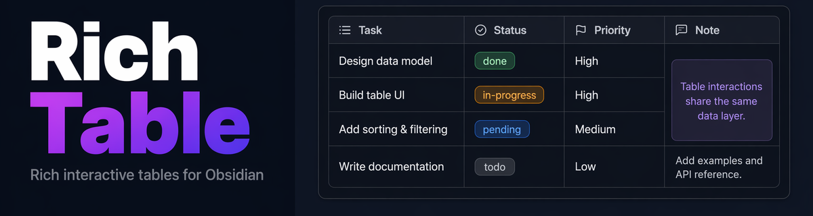

<p>
  <b>🔀 合并单元格 &nbsp;·&nbsp; 🏷️ 类型列 &nbsp;·&nbsp; 🎨 样式设置 &nbsp;·&nbsp; 🧊 冻结行列 &nbsp;·&nbsp; 🔽 排序筛选 &nbsp;·&nbsp; Σ 统计行 &nbsp;·&nbsp; 📑 多表工作簿 &nbsp;·&nbsp; 🗂️ 看板 &nbsp;·&nbsp; 📅 日历 &nbsp;·&nbsp; 🔗 双链补全 &nbsp;·&nbsp; 📐 数学公式</b>
</p>

<p>
  <a href="https://github.com/SdKay/obsidian-rich-table/releases/latest">
    
  </a>
  <a href="https://github.com/SdKay/obsidian-rich-table/releases">
    
  </a>
  <a href="LICENSE">
    
  </a>
  <a href="https://obsidian.md/plugins?id=rich-table">
    
  </a>
  <a href="https://paypal.me/ssdking">
    
  </a>
</p>

<p>
  <a href="#安装">安装</a> ·
  <a href="#功能演示">演示</a> ·
  <a href="#键盘操作">键盘操作</a> ·
  <a href="#设置">设置</a> ·
  <a href="#功能与计划">功能</a> ·
  <a href="#格式说明">格式</a> ·
  <a href="README.md">English</a>
</p>

<p>
  
  <br/><sub>扫码关注公众号，获取更多 Obsidian 插件与效率工具资讯</sub>
</p>

</div>

> **仅限 Obsidian 使用。** `rich-table` 围栏代码块由插件渲染，在标准 Markdown 编辑器或 GitHub 预览中无法显示。

为 Obsidian 打造的富交互表格插件——支持单元格合并、内联编辑、双链自动补全、类型列、数学公式、列表、图片、拖拽排序等功能。

---

## 为什么选择 Rich Table？

| 功能 | 原生表格 | Rich Table |
| --- | --- | --- |
| 单元格合并 | ✗ | ✓ |
| 点击单元格内联编辑 | ✗ | ✓ |
| 单元格内 `[[双链]]` 自动补全 | ✗ | ✓ |
| 单元格内数学公式（KaTeX） | ✗ | ✓ |
| 单元格内列表、加粗、链接、图片 | ✗ | ✓ |
| 多行内容 | ✗ | ✓ |
| 类型列（状态、优先级…） | ✗ | ✓ |
| 单元格样式（背景色/字号…） | ✗ | ✓ |
| 列对齐方式（左/居中/右） | ✗ | ✓ |
| 表格标题与底部备注 | ✗ | ✓ |
| 拖拽排序行 / 列 | ✗ | ✓ |
| 拖拽调整列宽 / 行高 | ✗ | ✓ |
| 插入 / 隐藏 / 删除行列 | ✗ | ✓ |
| 按值筛选行 | ✗ | ✓ |
| 单表锁定 | ✗ | ✓ |

---

## 安装

**推荐 — 社区插件浏览器：**

1. 打开 **设置 → 第三方插件 → 浏览**
2. 搜索 **Rich Table** 并安装
3. 启用插件

或直接跳转：[在 Obsidian 中打开](https://obsidian.md/plugins?id=rich-table)

**手动安装：** 将 `main.js`、`manifest.json`、`styles.css` 复制到 `<vault>/.obsidian/plugins/rich-table/`

最低 Obsidian 版本：**1.8.7**

---

## 功能演示

> **⬆️ 从 v0.x 升级？** — v1 → v2 迁移：旧格式表格的升级提示横幅，一键转换或保持旧格式只读浏览。
>
> 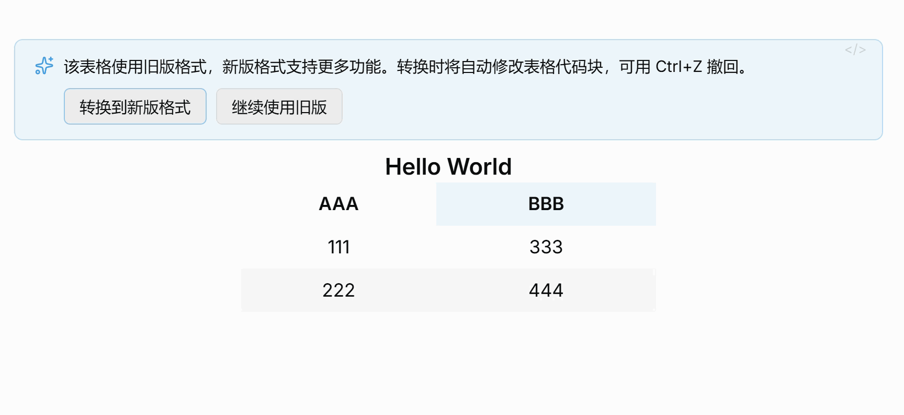


**1 · 模板快速开始 — 或插入空白表格**

空的 `rich-table` 代码块会为每个内置模板显示一个按钮（目前有展示全部功能的**演示表**和**康奈尔笔记**布局），再加上**插入空白表格**，后者会弹出类似 Word/Sheets 的尺寸选择器——鼠标划过 8×6 的网格实时预览、点击确认行列数，也可以直接输入精确数字（超出网格范围时使用）。鼠标悬停任意按钮会在下方实时预览对应内容；不悬停时默认预览第一个模板。模板文件放在 `src/templates/*.yaml` 里自动发现（跟主题系统同一套机制），新增模板不需要改代码。


**2 · 合并单元格** — 拖选 → 弹窗点 Merge


**3 · 类型列 & 样式设置** — 单击切换值，双击设置样式


**4 · 拖拽排序 & 行列操作** — ⠿ 手柄拖排 + 双击弹出操作菜单


**5 · 拖拽调整宽高** — 拖拽列标题右边缘调整列宽 · 拖拽行底边缘调整行高

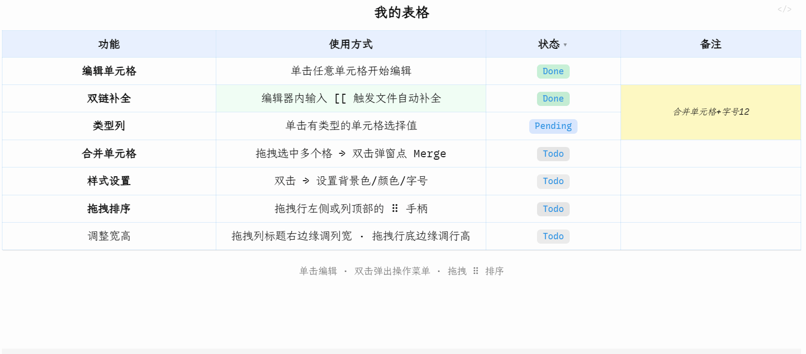

**6 · 标题与底部备注** — 单击内联编辑，Shift+Enter 换行

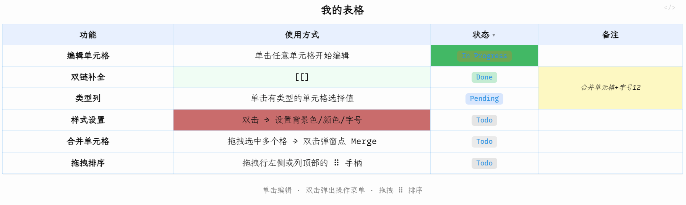

**7 · 列筛选** — 筛选展示表格


**8 · 富内容单元格** — 数学公式 · 加粗/斜体 · 链接 · 图片 · 列表 · 多行

> 🎬 *演示 GIF 即将发布*

**9 · 与 Excel/Markdown 互相复制粘贴** — 从 Excel/Sheets 复制的内容可直接粘贴进单元格（通过剪贴板 HTML 识别）；也可把选区复制为 Excel 兼容表格或 Markdown 表格，入口在选区/单元格/表头菜单

> 🎬 *演示 GIF 即将发布*

**10 · 行排序** — 列选择器弹出菜单：一次性排序或自动排序（表头常驻提示）

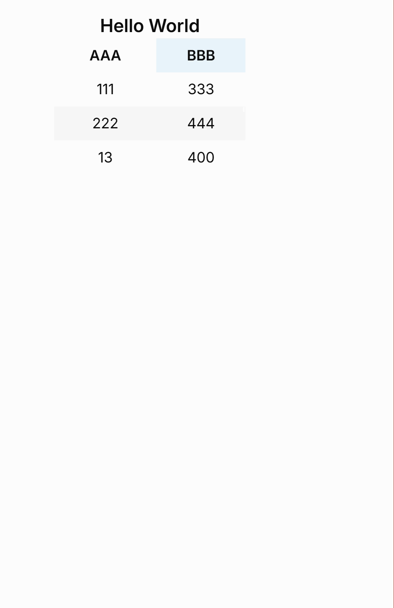

**11 · 汇总行** — 通过 Σ 图标或列选择器弹出菜单开启求和/平均/最小值/最大值/计数；每行可单独删除或拖拽调整顺序

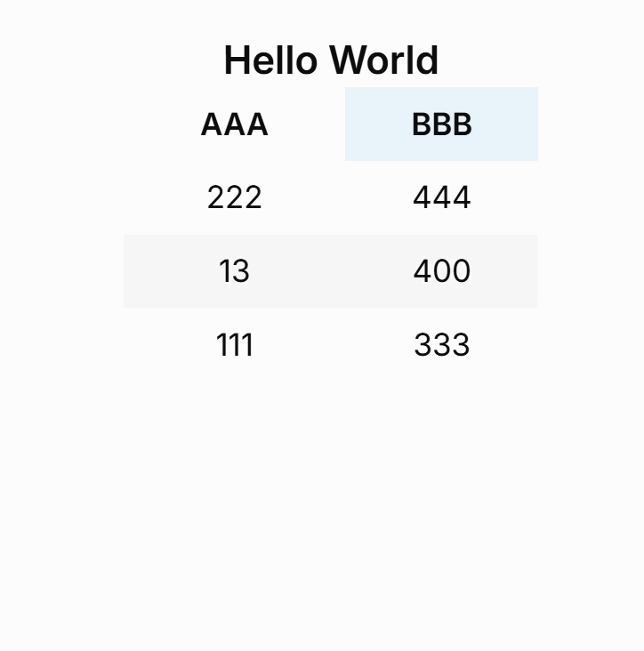

**12 · 表格折叠/展开** — 折叠图标按钮收起/展开表格内容，保留标题和表头可见

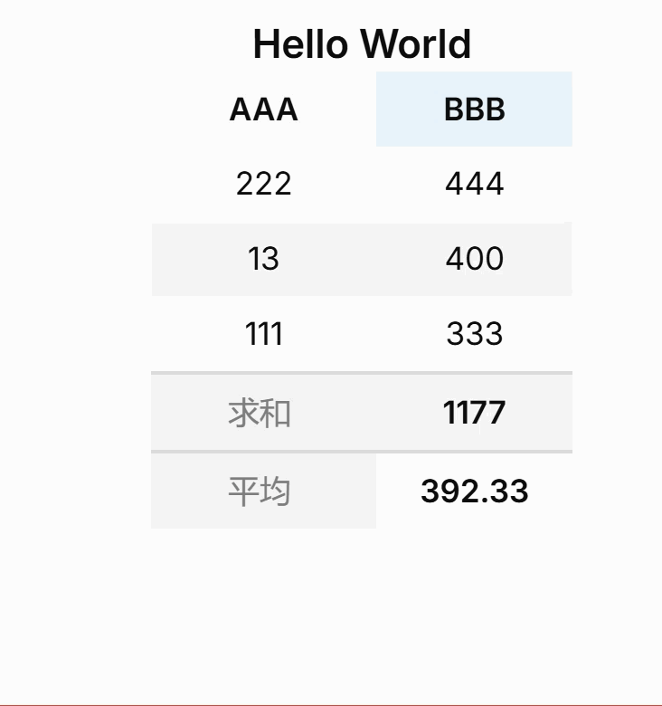

**13 · 表格锁定** — 🔒 图标禁用该表格的全部图形化编辑

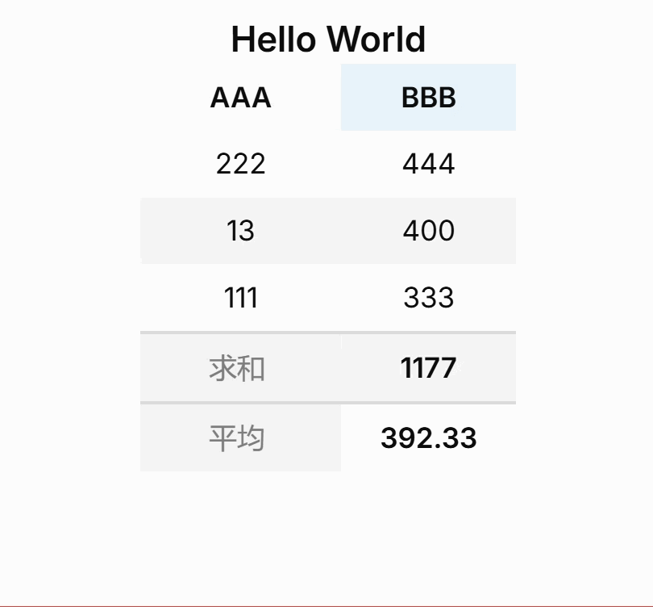

**14 · 一键自适应** — ⊞ 图标一次性把所有列宽和行高调整到贴合内容

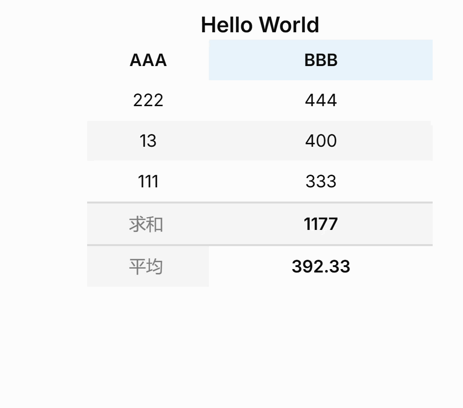

**15 · 主题切换** — 🎨 图标切换内置主题（`academic`、`grid`、`plain`）

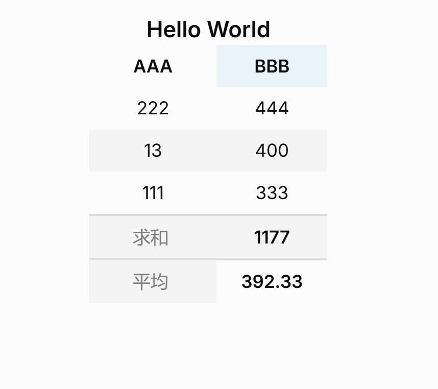

**16 · 拆分单元格** — 双击一个未合并的普通格 → 拆分为两行/两列，同行/列其他格保持原有外形

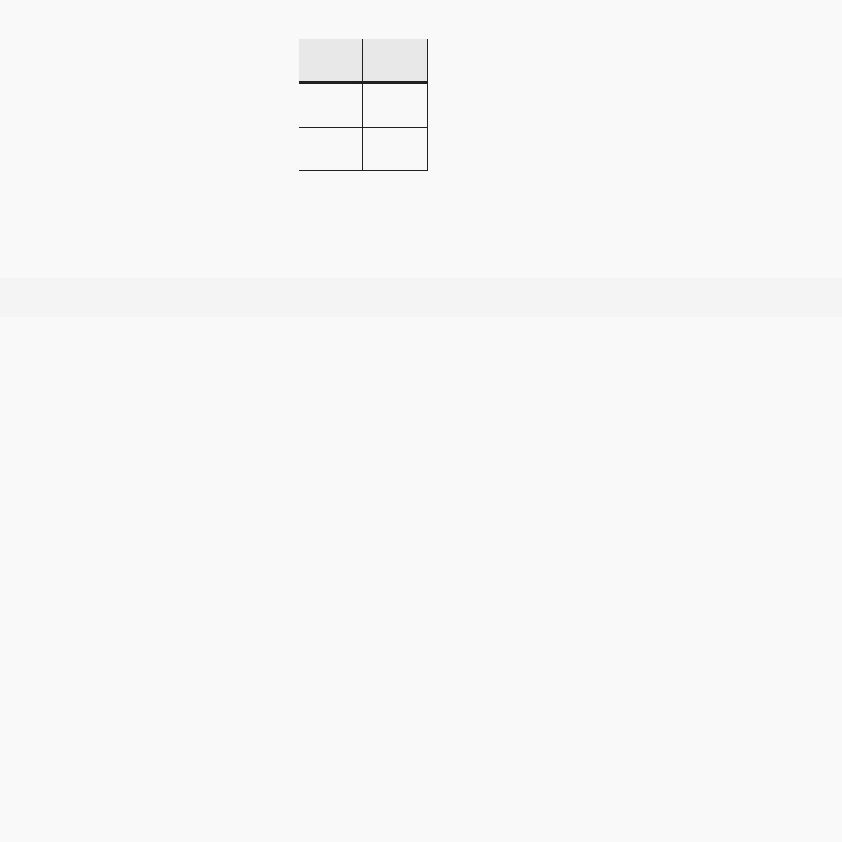

---

## 键盘操作

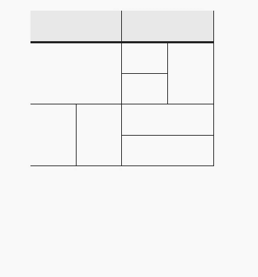


单元格有三种状态，下面所有快捷键都取决于当前处在哪一种。

**编辑态** —— 单元格里开着编辑器，单击进入的就是这个状态。

| 按键 | |
|------|--|
| `Esc` | 放弃本次编辑，该格转为**选中态**（与 Excel 一致，不写入任何内容） |
| `Enter` | 提交，该格转为**选中态** |
| `Tab` / `Shift`+`Tab` | 提交，并选中下一个 / 上一个单元格 |
| `←` `→` | 移动光标；光标已在首/尾字符时提交并选中左右相邻的单元格 |
| `↑` `↓` | 跳到本格内容的开头 / 末尾；已在开头/末尾时提交并选中上方 / 下方的单元格 |
| `Shift`+`Enter` | 在格内换行 |

**选中态** —— 单元格有高亮边框但没开编辑器，由上面的 `Esc` 或 `Enter` 进入。

| 按键 | |
|------|--|
| `←` `→` `↑` `↓` | 移动选中框。左右到行首尾会跨到相邻行；上下到表格边界则停住 |
| `Tab` / `Shift`+`Tab` | 等同 `→` / `←` |
| 任意字符 | 开始编辑，并用刚输入的字符替换原内容 |
| `Enter` | 开始编辑并保留原内容（内容为全选状态，按一个键即整体替换） |
| `Backspace` / `Delete` | 直接清空该格，不进入编辑态 |

补充：

- **表头参与导航** —— 从第一行数据行按 `↑` 即可到达；在表头输入即为重命名该列。
- **合并单元格**只会落在其锚点格，不会落进被它覆盖的位置；**隐藏行列与被筛掉的行**会自动跳过。
- **类型列**按各自类型响应：日期格打开原生选择器，此时方向键用于切换/增减年月日；选择格打开的是 Obsidian 自带的选项菜单，按 Obsidian 菜单的常规方式操作即可。两者都可用 `Tab` 提交并跳到下一格。

---

## 公式

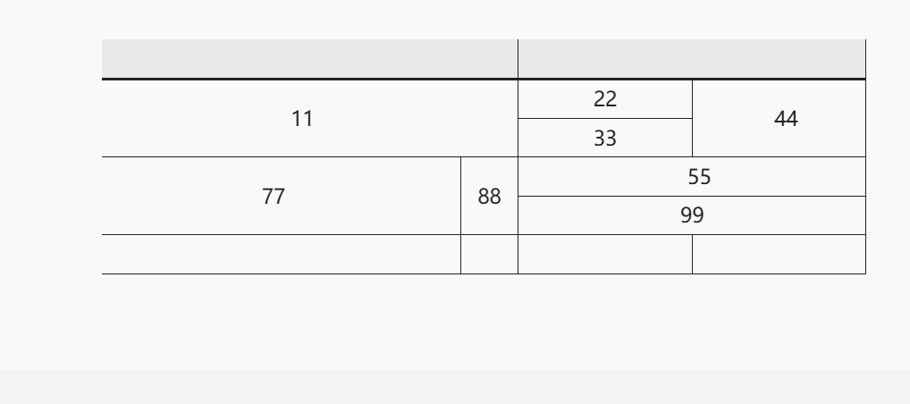

在普通单元格里输入 `=` 即可开始输入公式，与 Excel/Sheets 的习惯一致。支持四则运算（`+ - * /`，可加括号）和 `SUM`/`AVG`/`MIN`/`MAX`/`COUNT` 对一个范围求值。输入过程中点击另一个单元格即可插入引用，拖拽可插入一个范围，不需要手写单元格地址。

公式跟随被引用的行/列本身，不是位置，所以插入或调整行列顺序都不会破坏已有公式。被引用的行/列被删除会显示 `#REF!`；其他结果还有 `#CIRCULAR!`（自我引用）、`#DIV/0!`、`#VALUE!`。

---

## Claude Code Skill

仓库中附带了 [`SKILL.md`](SKILL.md)，可与 [Claude Code](https://claude.ai/code) 配合使用。安装后，Claude agent 可以直接在 vault 中创建和修改 `rich-table` 块——添加行、设置样式、定义合并——无需记忆语法。

```bash
cp SKILL.md ~/.claude/skills/rich-table/SKILL.md
```

之后告诉 Claude："在我的笔记里用 rich-table 创建一个项目看板"，它会自动生成对应的代码块。

---

## 设置

打开 **设置 → Rich Table** 进行配置。

| 设置项 | 默认值 | 说明 |
|--------|--------|------|
| 阅读模式下允许编辑 | 关闭 | 关闭时，阅读模式下所有交互行为（hover 条带、单击编辑、双击面板、下拉选值）均被禁用。实时预览 / 源码模式不受影响。 |
| 单击进入编辑 | 关闭 | 开启后，单击单元格立即进入编辑（无延迟），样式面板改用 Ctrl/Cmd+单击打开（而非双击）。关闭时（默认）：单击延迟一小段时间后进入编辑，双击打开样式面板。 |
| 自定义类型 | — | 自定义带标签和颜色的选择列类型。 |

---

## 功能与计划

状态：**✅** 已发布 · **🔜** 计划中。优先级反映的是与当前设计的契合度——**P1** 用现有架构直接可做 · **P2** 契合架构，但需要在其中新增一块 · **P3** 需要改架构、引入重依赖，或还没想清楚。

<table>
<thead>
<tr><th align="left">分类</th><th align="left">功能</th><th align="center">状态</th><th align="center">优先级</th></tr>
</thead>
<tbody>

<tr>
  <td rowspan="6"><b>编辑</b></td>
  <td>点击任意单元格即可编辑，支持完整 Markdown；输入 <code>[[</code> 触发 Obsidian 原生的文件与标题补全</td>
  <td align="center">✅</td><td align="center">—</td>
</tr>
<tr><td>键盘操作——方向键、Tab、直接打字替换内容（详见<a href="#键盘操作">键盘操作</a>）</td><td align="center">✅</td><td align="center">—</td></tr>
<tr><td>单元格 / 表头 / 选区菜单——插入、删除、隐藏行列，合并，设置样式，切换列类型与对齐</td><td align="center">✅</td><td align="center">—</td></tr>
<tr><td>与 Excel / Sheets 互通剪贴板——把一片区域粘进单元格，也可把选区复制回去（或复制为 Markdown 表格）</td><td align="center">✅</td><td align="center">—</td></tr>
<tr><td>表格标题与页脚注释——点击即可就地编辑</td><td align="center">✅</td><td align="center">—</td></tr>
<tr><td>单元格批注</td><td align="center">🔜</td><td align="center">P2</td></tr>

<tr>
  <td rowspan="4"><b>单元格内容</b></td>
  <td>完整的 Obsidian Markdown——加粗、斜体、高亮、<code>[[双链]]</code>、外部链接、列表、多行</td>
  <td align="center">✅</td><td align="center">—</td>
</tr>
<tr><td>数学公式——行内 KaTeX，<code>$E=mc^2$</code></td><td align="center">✅</td><td align="center">—</td></tr>
<tr><td>图片——<code></code> 或 <code>![[local.png]]</code>，拖动边缘缩放</td><td align="center">✅</td><td align="center">—</td></tr>
<tr><td>在单元格里只读嵌入另一个表格</td><td align="center">🔜</td><td align="center">P3</td></tr>

<tr>
  <td rowspan="7"><b>列与数据</b></td>
  <td>类型列——彩色胶囊标签，点击选值；6 种内置类型，也可在设置里自定义</td>
  <td align="center">✅</td><td align="center">—</td>
</tr>
<tr><td>按值筛选行——每个列标题上的漏斗图标</td><td align="center">✅</td><td align="center">—</td></tr>
<tr><td>行排序——一次性排序，或实时排序并显示指示器直到取消</td><td align="center">✅</td><td align="center">—</td></tr>
<tr><td>统计行——对当前可见行求 Sum / Average / Min / Max / Count</td><td align="center">✅</td><td align="center">—</td></tr>
<tr><td>公式——Excel 风格的 <code>=SUM(A1:B3)</code>、四则运算、点击/拖拽插入引用</td><td align="center">✅</td><td align="center">—</td></tr>
<tr><td>进度条列类型</td><td align="center">🔜</td><td align="center">P1</td></tr>
<tr><td>把本表数据画成图表</td><td align="center">🔜</td><td align="center">P2</td></tr>

<tr>
  <td rowspan="4"><b>样式</b></td>
  <td>单元格级的背景色、文字颜色与字号——面板设置或写在 YAML 里</td>
  <td align="center">✅</td><td align="center">—</td>
</tr>
<tr><td>行列选择器条带——悬停显现，一次给整行或整列设置样式</td><td align="center">✅</td><td align="center">—</td></tr>
<tr><td>主题——<code>academic</code>、<code>grid</code>、<code>plain</code>；另有几个 CSS 变量用于小幅微调（详见<a href="#主题">主题</a>）</td><td align="center">✅</td><td align="center">—</td></tr>
<tr><td>条件格式——按取值规则自动套用样式</td><td align="center">🔜</td><td align="center">P2</td></tr>

<tr>
  <td rowspan="7"><b>表格结构</b></td>
  <td>合并单元格，以及把普通单元格拆成两行或两列</td>
  <td align="center">✅</td><td align="center">—</td>
</tr>
<tr><td>拖拽重排行列；拖拽调整宽高；双击或 ⊞ 一键自适应</td><td align="center">✅</td><td align="center">—</td></tr>
<tr><td>插入、隐藏、删除行列；悬停边缘出现 <b>+</b> 快捷条</td><td align="center">✅</td><td align="center">—</td></tr>
<tr><td>冻结表头及前 N 行 / 前 N 列</td><td align="center">✅</td><td align="center">—</td></tr>
<tr><td>转置起始模板——行、列表头内容一致</td><td align="center">🔜</td><td align="center">P1</td></tr>
<tr><td>一键转置——交换行与列</td><td align="center">🔜</td><td align="center">P2</td></tr>
<tr><td>行分组——可折叠分组</td><td align="center">🔜</td><td align="center">P3</td></tr>

<tr>
  <td rowspan="2"><b>视图</b></td>
  <td>看板——按任意选择类型的列分组成泳道，拖动卡片即改变该列取值</td>
  <td align="center">✅</td><td align="center">—</td>
</tr>
<tr><td>日历——按任意日期列排进月视图，拖动事件即改期</td><td align="center">✅</td><td align="center">—</td></tr>

<tr>
  <td rowspan="2"><b>多表工作簿</b></td>
  <td>工作簿——表格有两个以上 sheet 时底部出现 Excel 式标签栏，每个 sheet 各有自己的列、行、样式与视图</td>
  <td align="center">✅</td><td align="center">—</td>
</tr>
<tr><td>标签页——单击切换，双击重命名，拖拽重排，右键设置颜色 / 删除</td><td align="center">✅</td><td align="center">—</td></tr>

<tr>
  <td rowspan="3"><b>整表操作</b></td>
  <td>锁定——🔒 关闭该表格的所有图形化编辑</td>
  <td align="center">✅</td><td align="center">—</td>
</tr>
<tr><td>折叠——隐藏表体，保留标题与表头行</td><td align="center">✅</td><td align="center">—</td></tr>
<tr><td>让表格对应一份外部 <code>.xlsx</code> 文件，并在 Obsidian 里编辑它</td><td align="center">🔜</td><td align="center">P3</td></tr>

</tbody>
</table>

---

## 格式说明

````markdown
```rich-table
---
version: 2
title: 项目看板
columns:
  - id: c_000000
    name: 任务
    width: 200
  - id: c_000001
    name: 状态
    type: task-status
    width: 110
rows:
  - id: r_000000
    cells:
      c_000000: "**设计** — 架构评审"
      c_000001: done
  - id: r_000001
    cells:
      c_000000: 编码实现
      c_000001: pending
  - id: r_000002
    cells:
      c_000000: |-
        - 编写测试
        - 修复边界情况
      c_000001: todo
merges:
  - anchor: r_000000.c_000000
    end: r_000001.c_000000
styles:
  - target: header
    bold: true
    bg: "#e8f0fe"
  - target: r_000000.c_000001
    bg: "#f0fdf4"
footer: "每周更新 · 点击任意单元格即可编辑"
---
<!-- Generated by Rich Table. Do not edit below — data source is the YAML front-matter above. -->
| 任务                    | 状态    |
| ----------------------- | ------- |
| **设计** — 架构评审     | done    |
| 编码实现                | pending |
| - 编写测试<br>- 修复... | todo    |
```
````

YAML 头部是**唯一的数据来源**。`<!-- Generated … -->` 注释下方的 pipe table 是只读镜像，每次写回时自动重新生成，可安全忽略。

**单元格内容**支持完整 Obsidian Markdown：`**加粗**`、`*斜体*`、`[[双链]]`、`[链接](url)`、``、`- 列表项`、`$数学公式$`、`<br>` 换行。

**样式 target**（v2 ID 格式）：

| 写法 | 含义 |
|------|------|
| `header` | 整个表头行 |
| `header.c_xxx` | 单个表头格 |
| `r_xxx` | 整行（数据行） |
| `c_xxx` | 整列（含表头） |
| `r_aaa:r_bbb` | 行范围 |
| `c_aaa:c_bbb` | 列范围 |
| `r_aaa.c_aaa:r_bbb.c_bbb` | 矩形范围 |
| `r_xxx.c_yyy` | 单个数据格 |

> **从 v0.x 升级？** 旧格式表格会自动显示升级提示横幅，点击**转换到新版格式**一键迁移，或点击**继续使用旧版**保持原样只读浏览。

---

## 主题

在 YAML 前置元数据中加入 `theme:` 字段即可应用内置主题：

```yaml
theme: academic   # 学术三线表风格——仅上/中/下三条横线，无竖线
theme: grid       # Excel 全边框风格——完整网格线，加粗外边框和表头分隔线
theme: plain      # 彩虹渐变表头 + 动态边框
```

| 主题 | 说明 |
|------|------|
| *(不填)* | 默认——无特殊样式 |
| `academic 📐` | 仿 LaTeX booktabs 风格：上线 / 中线 / 下线，无竖线，无单元格背景 |
| `grid 🔲` | 每个单元格都有网格线，外边框加粗，表头与数据之间的分隔线也加粗 |
| `plain 🙂` | 呼吸渐变表头、彩虹动态边框、光标辐射行高亮 |

主题只影响视觉效果，不影响数据和布局。

**不选主题也能快速微调：** 只想改个小细节（不想套完整主题）时，在 Obsidian 的 CSS snippet 里对 `.bt-render-root` 设置以下变量即可，不需要写任何选择器：

| 变量 | 控制内容 | 默认值 |
|------|---------|--------|
| `--bt-border-outer` | 表格外边框 | `none` |
| `--bt-cell-border`（及 `-right`/`-bottom`） | 单元格之间的网格线 | `none` |
| `--bt-cell-bg` | 数据单元格背景 | `transparent` |
| `--bt-header-bg` | 表头单元格背景 | 随主题默认值 |
> 每个单元格只画自己的**右边**和**下边**，网格最上和最左那条边由表格自身的 `--bt-border-outer` 提供。`--bt-cell-border-top`/`-left` 仍然接受，但不再参与网格线绘制 —— 一条边只由一个单元格画，四边都画会让每条内部线变成双倍粗。冻结行/列在滚动时能保住网格线，靠的就是这一点。

```css
.bt-render-root {
  --bt-header-bg: #223;
  --bt-cell-bg: #fafafa;
  --bt-border-outer: 2px solid #888;
}
```

通过样式面板手动设置的单元格样式，始终优先于主题和这些变量。

---

## 已知问题

| 问题 | 临时方案 |
|------|---------|
| **阅读模式下 v2 表格仍可交互** — 在 Obsidian 阅读视图中，v2 格式的表格仍会显示 hover 条带并允许编辑，`allowReadingViewEdit` 设置对 v2 表格无效。v1 旧格式表格（待升级状态）的阅读模式限制正常。 | 使用 🔒 锁定按钮防止在阅读模式下误编辑。 |

---

## 许可证

[AGPL-3.0](LICENSE)——衍生作品须以相同协议开源。

**商业授权**请联系：sdkxyx@gmail.com

---

## 赞助支持
Rich Table 是完全免费开源的插件，采用 AGPL-3.0 协议开源。如果这个插件提升了你的笔记效率，欢迎通过自愿捐赠支持后续开发，你的支持是持续修复问题、新增功能、适配 Obsidian 新版本的最大动力。

### 🌍 PayPal
[](https://paypal.me/ssdking)

### 🧧 微信 / 支付宝
| 微信支付 | 支付宝 |
|:---:|:---:|
|  |  |

感谢支持！🙏

---

## 支持与反馈

问题反馈与功能建议：[GitHub Issues](https://github.com/SdKay/obsidian-rich-table/issues)

---

[](https://star-history.com/#SdKay/obsidian-rich-table&Date)

